# 🍎 Apple Fruit Disease Detection System using Deep Learning

  

  <b>AI-Powered Apple Fruit Disease Detection using EfficientNet CNN, Flask, and Computer Vision</b>

---

# 📌 Project Overview

Apple Fruit Disease Detection System is a Deep Learning-powered web application that detects diseases in apple fruits from uploaded images using an EfficientNet-based Convolutional Neural Network (CNN).

The system combines Artificial Intelligence, Computer Vision, and Full-Stack Web Development to provide real-time disease prediction with confidence scores through an interactive Flask web application.

This project demonstrates the practical application of AI in smart agriculture by automating disease detection and reducing manual inspection efforts.

---

# 🎯 Problem Statement

Manual identification of fruit diseases requires agricultural expertise and significant time for inspection. Delayed or incorrect diagnosis may lead to crop damage, reduced productivity, and financial loss.

This project aims to automate apple fruit disease detection using Artificial Intelligence and Deep Learning techniques to provide faster and more accurate predictions.

---

# 💡 Objectives

- Automate apple fruit disease detection using AI
- Reduce manual inspection time
- Enable early disease identification
- Improve agricultural productivity
- Build a real-time AI-powered prediction system
- Develop a user-friendly web application for disease analysis

---

# 🔗 Project Links

- 💻 **GitHub Repository**  
  https://github.com/sivakavihemalatha-hub/apple-disease-detection-web-app

- 🎥 **Project Demo Video**  
  https://drive.google.com/file/d/11TN6q_NIrTfSdLQid7UGX-mlCglYVNWE/view?usp=drive_link

---

# 🏆 Key Features

- 🍎 Detects multiple apple fruit diseases using Deep Learning
- 🤖 EfficientNet-based CNN image classification model
- 📈 Achieved 87% validation accuracy
- 🌐 Flask-based AI web application
- 👤 User and Admin authentication system
- 📊 Prediction history management
- 🗄️ SQLite database integration
- ⚡ Real-time image upload and disease prediction
- 🔐 Role-based access control system

---

# 📊 Dataset Information

The dataset was collected from multiple sources:
- Kaggle
- Mendeley
- Agricultural image datasets

### Disease Categories
- Anthracnose
- Black Pox
- Black Rot
- Healthy
- Powdery Mildew

---

# 🤖 Deep Learning Model

| Feature | Details |
|---|---|
| Model Type | Convolutional Neural Network (CNN) |
| Architecture | EfficientNet |
| Framework | TensorFlow / Keras |
| Training Platform | Google Colab |
| Input Size | 224 × 224 |
| Model Format | `.keras` |
| Validation Accuracy | 87% |

---

# 📈 Model Performance

## 📌 Evaluation Metrics

- **Accuracy:** 87%
- **Precision:** 86%
- **Recall:** 87%
- **F1-Score:** 86%

---

## 📊 Classification Report

| Class | Precision | Recall | F1-Score | Support |
|---|---|---|---|---|
| Anthracnose | 66% | 75% | 70% | 69 |
| Black Pox | 97% | 97% | 97% | 92 |
| Black Rot | 82% | 74% | 78% | 134 |
| Healthy | 95% | 94% | 95% | 143 |
| Powdery Mildew | 91% | 94% | 92% | 104 |

---

## 📊 Confusion Matrix

  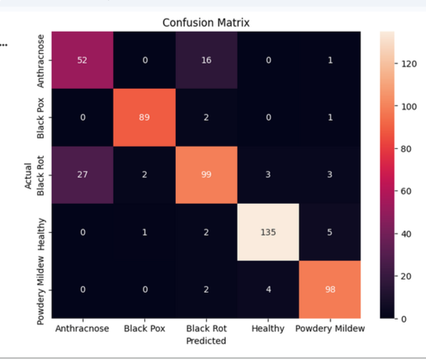

---

## 📈 Training vs Validation Accuracy

  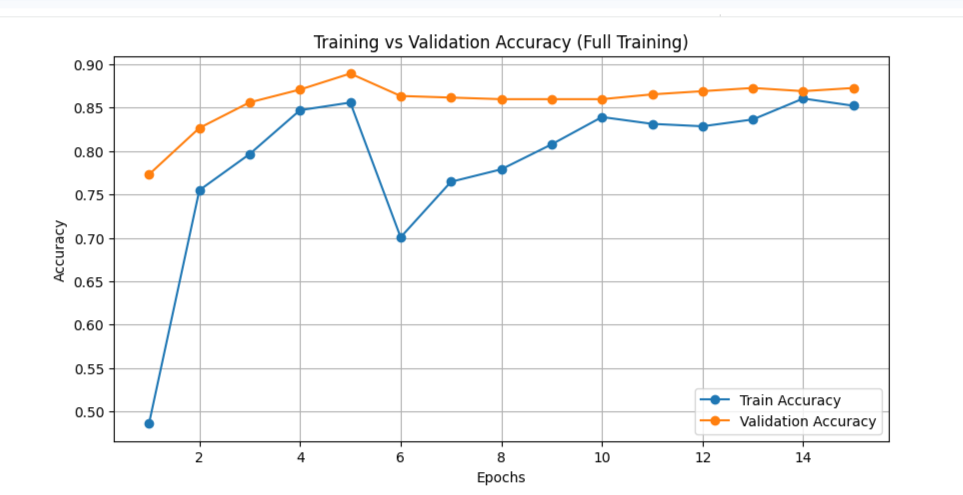

---

## 📉 Training vs Validation Loss

  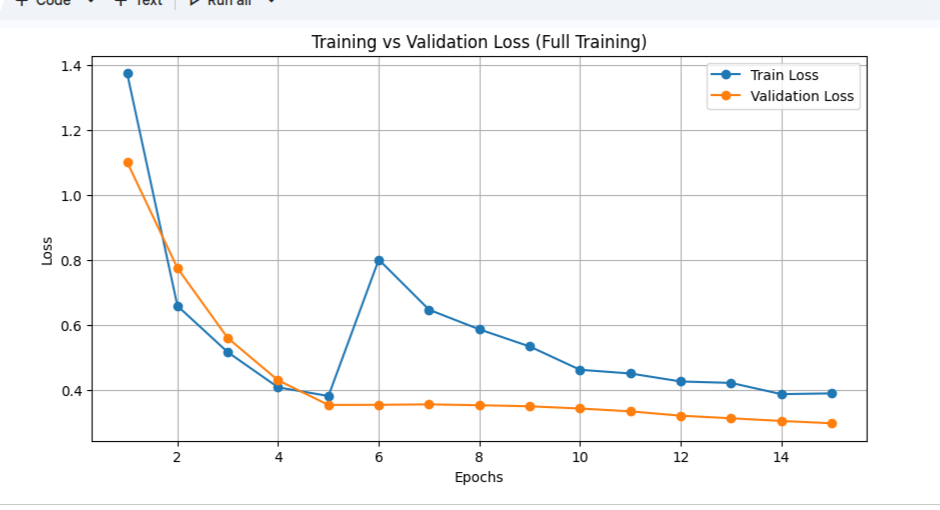

---

# 🔁 System Workflow

1. User logs into the system
2. Apple fruit image is uploaded
3. Image resized to 224×224
4. EfficientNet preprocessing applied
5. CNN model performs prediction
6. Disease class generated
7. Confidence score displayed
8. Prediction stored in SQLite database
9. User/Admin can view prediction history

---

# 🌐 Web Application Modules

## 👤 User Module

- User Registration & Login
- Upload Fruit Images
- Disease Prediction
- Prediction History
- Profile Management
- Logout System

---

## 🧑‍💼 Admin Module

- Admin Authentication
- View All User Predictions
- Manage Prediction Records
- Monitor User Activity
- System-Level Access Control

---

# 🛠️ Technology Stack

## 🔹 Frontend
- HTML
- CSS
- JavaScript

## 🔹 Backend
- Python
- Flask
- SQLite

## 🔹 Machine Learning
- TensorFlow
- Keras
- EfficientNet
- NumPy
- PIL

## 🔹 Development & Deployment
- Google Colab
- Ngrok
- GitHub

---

# 🗄️ Database Design

## Users Table
- id
- email
- password
- role

## History Table
- id
- username
- image_path
- prediction
- confidence
- timestamp

---

# 🎥 Project Demo

The demo video showcases:
- User authentication system
- Admin dashboard
- Real-time image upload
- AI disease prediction
- Prediction history tracking
- Role-based access control

▶️ **Demo Video**  
 https://drive.google.com/file/d/11TN6q_NIrTfSdLQid7UGX-mlCglYVNWE/view?usp=drive_link
---

# 📸 Application Screenshots

## 🏠 Home Page

  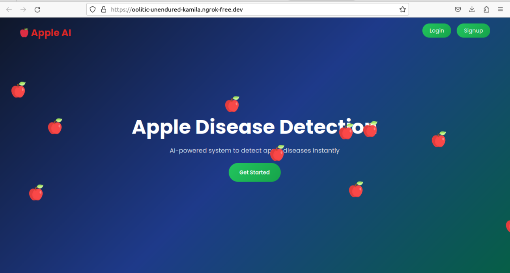

---

## 🔐 Login Page

  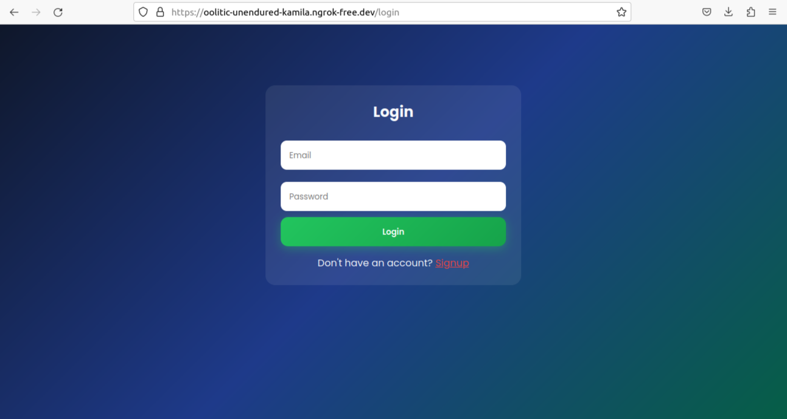

---

## 📝 Signup Page

  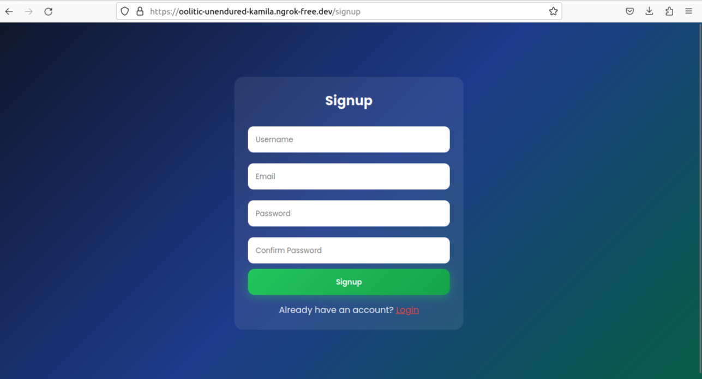

---

## 📊 User Dashboard

  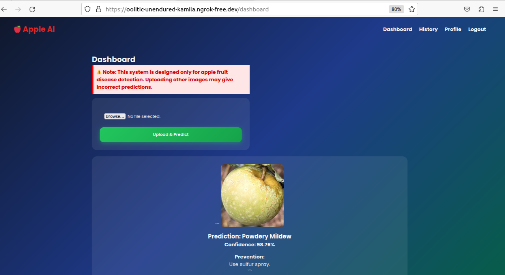

---

## 📜 Prediction History

  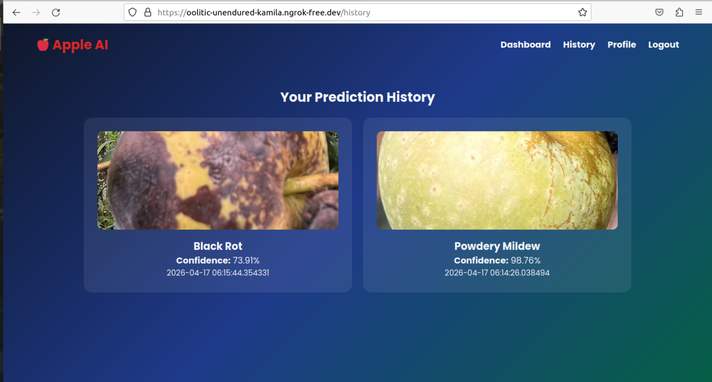

---

## 👤 Profile Page

  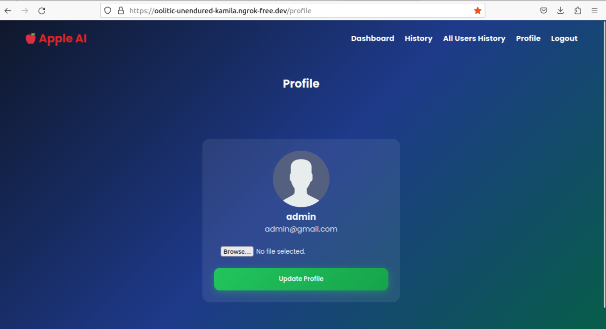

---

## 🧑‍💼 Admin Dashboard

  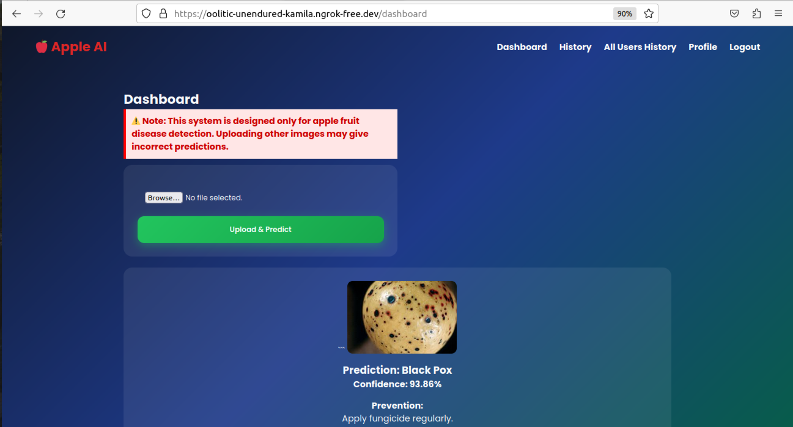

---

## 📂 All Users History

  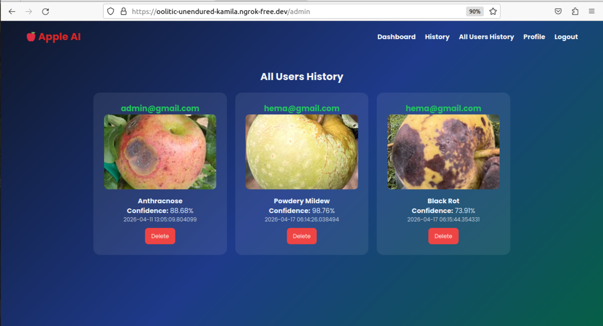

---

# 🚀 Future Enhancements

- Improve model accuracy with larger datasets
- Deploy using cloud platforms
- Add mobile application support
- Extend to multiple fruit disease categories
- Add explainable AI visualizations

---

# 💡 Project Impact

This system demonstrates how Artificial Intelligence and Computer Vision can support smart agriculture by enabling early disease detection and reducing agricultural losses.

---

# 👨‍💻 Author

## Hemalatha Sivakavi

📧 Email: sivakavihemalatha@gmail.com

💻 GitHub  
https://github.com/sivakavihemalatha-hub

🔗 LinkedIn  
https://linkedin.com/in/sivakavihemalatha

---

# ⭐ Support

If you found this project useful, consider giving this repository a ⭐ on GitHub.
